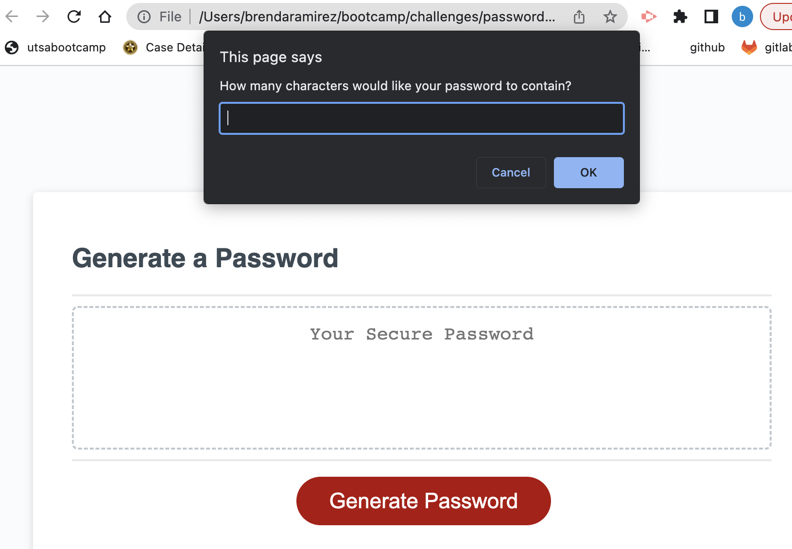

# Password Generator

## Description
For this project I built a password generator that will create a random password based on the criteria selected by the user. User is able to select character length (between 8-128 characters) and a combination of uppercase, lowercase and special characters. 

## Visuals

## Installation
Additional programs or extension installation is not needed, the app will run in the browser. Please select the following Github link: https://bramirez09.github.io/passwordgenerator/

## Usage
User can specify character length (between 8-128 characters long), can confirm whether or not to include lowercase, uppercase, numeric and/or special characters. After criteria is confirmed application will generate password accordinly to user input and selection. 